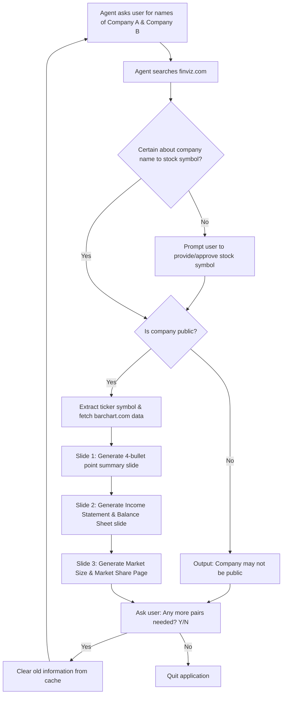

# Are they competitors? — Technical Specification

## 1. Overview & Objective

This specification incorporates all requirements from `Competitors.docx` and `Are they competitors.docx`. The application answers the core question: **"Are they competitors?"** by evaluating two user-provided company names (`Company A` and `Company B`), verifying public stock market existence, rendering three structured presentation slides per comparison, handling symbol approval for uncertain matches, and clearing cache between searches.

---

## 2. Core Questions & System Tasks

1. **Company Name & Stock Symbol Verification**:
   - Agent asks user for the names of two companies: **Company A** and **Company B**.
   - Agent searches **`finviz.com`**.
   - If both companies exist on the stock market: Confirm existence and provide their stock ticker symbols (e.g., `F` for Ford, `GM` for General Motors).
   - If a company does not exist or is unlisted: State clearly: `"<Company Name> may not be public"`.
   - **Symbol Disambiguation & User Approval**: If the agent cannot be certain about mapping a company name to a stock symbol, prompt the user to provide the stock symbol, then review and approve the choice.

2. **Slide 1 — Business Summary & 4-Bullet Point Summary Slide**:
   - Provide business overview as shown on **`barchart.com`** (e.g., Ford: `https://www.barchart.com/stocks/quotes/F/overview`).
   - Generate a summary slide for each company featuring **4 concise bullet points** covering:
     1. Core Products & Services
     2. Operating Divisions & Segments
     3. Financial & Subsidiary Operations
     4. Market Focus & Strategic Position

3. **Slide 2 — Financial Statements (Latest Income Statement & Balance Sheet)**:
   - Display key figures from the latest **Income Statement** and **Balance Sheet**:
     - **Income Statement Highlights**: Total Revenue, Gross Profit, Operating Income, Net Income, EPS.
     - **Balance Sheet Highlights**: Total Assets, Total Liabilities, Total Stockholders' Equity, Cash & Cash Equivalents, Total Debt.

4. **Slide 3 — Market Size of Segment & Market Share Analysis Page**:
   - **Common Market Segment**: Identify the shared industry segment (e.g. *Auto Manufacturers*, *Consumer Electronics*, *Software - Infrastructure*).
   - **Market Size of Segment (TAM)**: Calculate the Total Addressable Market (TAM) size for the common segment.
   - **Market Share of Company A**: Calculate Company A's percentage market share within the segment (`Revenue(A) / Segment Market Size`).
   - **Market Share of Company B**: Calculate Company B's percentage market share within the segment (`Revenue(B) / Segment Market Size`).
   - **Remaining Market Share**: Share held by other segment competitors (`100% - Share(A) - Share(B)`).
   - **Visual Market Share Bars**: Render interactive visual progress bars and market share breakdown metrics.

5. **Interactive Query Loop & Cache Management**:
   - Ask the user: **"Any more pairs needed? (Y/N)"**
   - If **Yes** (`Y`): **Clear old information from cache** (flush previous search data) and repeat search for the new pair.
   - If **No** (`N`): Quit the application.

---

## 3. Workflow Diagram

---

## 4. Slide 3 Specification: Market Size & Market Share Page

| Field / Metric | Description | Calculation / Extraction Formula |
|---|---|---|
| **Common Segment Title** | Shared industry sector and sub-segment | Extracted from sector/industry taxonomy |
| **Segment Market Size (TAM)** | Total Addressable Market size of the common segment | Segment market valuation model |
| **Company A Market Share (%)** | Percentage share of segment held by Company A | `(Revenue_A / Segment_Market_Size) * 100%` |
| **Company B Market Share (%)** | Percentage share of segment held by Company B | `(Revenue_B / Segment_Market_Size) * 100%` |
| **Remaining Market Share (%)** | Share held by other industry players | `100% - Share_A - Share_B` |
| **Market Leader Badge** | Identifies the dominant entity in the shared segment | `Max(Share_A, Share_B)` |

---

## 5. Reference Example (from `Competitors.docx`)

- **Company A**: Ford Motor Company (`F`)
- **Company B**: General Motors Company (`GM`)
- **Common Market Segment**: Auto Manufacturers (Global Automotive Industry)
- **Estimated Segment Market Size (TAM)**: ~$2.50 Trillion
- **Ford Segment Revenue**: ~$187.97 Billion (Market Share: ~7.52%)
- **GM Segment Revenue**: ~$185.53 Billion (Market Share: ~7.42%)
- **Remaining Segment Share**: ~85.06% (Toyota, Volkswagen, Hyundai, etc.)
